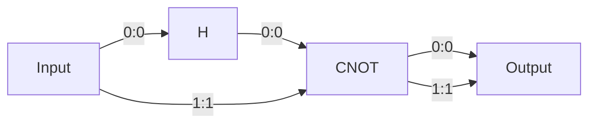
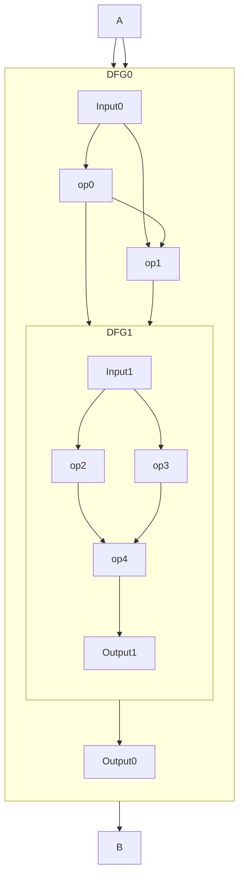
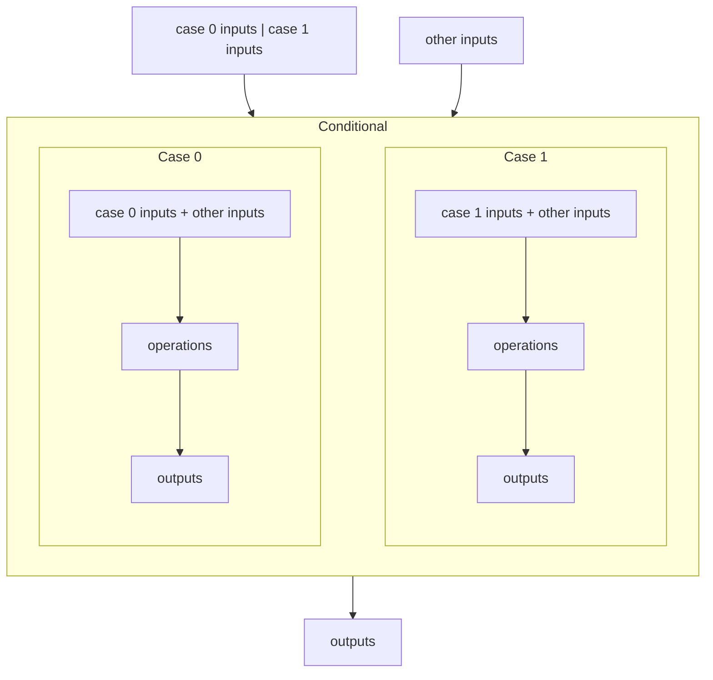
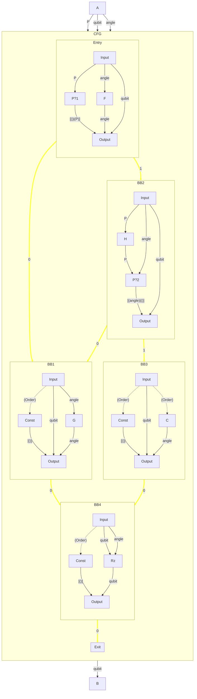
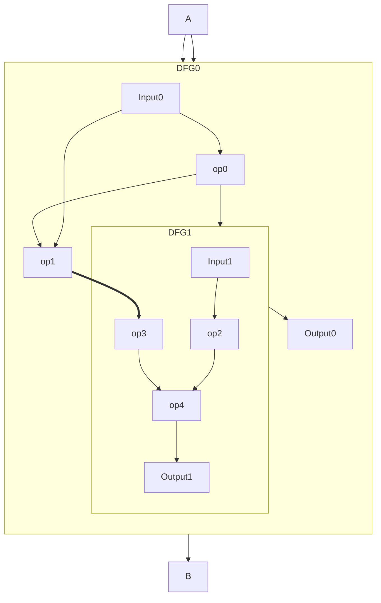

# HUGR design document

The Hierarchical Unified Graph Representation (HUGR, pronounced *hugger* 
🫂) is a proposed new
common internal representation used across TKET2, Tierkreis, and the L3
compiler. The HUGR project aims to give a faithful representation of
operations, that facilitates compilation and encodes complete programs,
with subprograms that may execute on different (quantum and classical)
targets.

## Motivation

Multiple compilers and tools in the Quantinuum stack use some graph-like
program representation; be it the quantum circuits encoded as DAGs in
TKET, or the higher-order executable dataflow graphs in Tierkreis.

The goal of the HUGR representation is to provide a unified structure
that can be shared between the tools, allowing for more complex
operations such as TKET optimizations across control-flow blocks, and
nested quantum and classical programs in a single graph.
The HUGR should provide a generic graph representation of a program,
where each node contains a specific kind of operation and edges
represent (typed) data or control dependencies.

### Goals

  - Modular design, allowing new operations, data types, and rewrite
    methods defined by third-parties.
  - Represent mixed quantum-classical programs, allowing for efficient
    lowering through bespoke compilation to dedicated targets.
  - Efficiently serializable. Different tools should be able to send and
    receive HUGRs via a serialized interface when sharing the in-memory
    structure is not possible.
  - Provide a common interface for rewrite operations with support for
    opaque types.

### Non-goals

  - Translations to other representations. While the HUGR should be able
    to encode programs in languages such as QIR, the translation should
    be implemented by separate crates.
  - Execution, or any kind of interpretation of the program. The HUGR
    describes the graph representation and control flow, without fixing
    the semantics of any extension operations defined outside the core
    set in this document, which will be most in actual use.

### Main requirements

  - A directed graph structure with extensible operation types in the
    nodes and data types in the edges.
  - Indexed connection ports for each operation node, which may be
    connected to another port with the same data type or remain
    unconnected.
  - Control-flow support with ability to capture both LLVM SSACFG style
    programs and programs from future front-ends designed to target
    HUGR. These including the upcoming Python eDSL for quantum-classical
    programming, and BRAT (which already uses an internal graph-like
    representation for classical functional programs and quantum
    kernels). We expect that these front-ends will provide
    programmer-facing control flow constructs that map to the preferred
    constructs in HUGR without first having to pass through an
    LLVM/SSACFG intermediate.
  - Support for nested structures. The nodes form a tree-like hierarchy
    with nested graphs encoded as children of their containing node.
  - User-defined metadata, such as debug information, can be efficiently
    attached to nodes and queried.
  - All user-provided information can be encoded and decoded in a stable
    (versioned) efficient serialized format.
  - A type system for checking valid operation connectivity + (nice to
    have) only operations supported on specific targets are used.
  - A space efficient and user friendly specification of a subgraph and
    replacement graph, along with an efficient routine for performing
    the replacement.

## Functional description

A HUGR is a directed graph. There are several different types of node, and
several different types of edge, with different semantics, described below.

A node usually has additional data associated with it, which we will
refer to as it's node weight.

The nodes represent
processes that produce values - either statically, i.e. at compile time,
or at runtime. Each node is uniquely identified by its **node index**,
although this may not be stable under graph structure modifications.
Each node is defined by its **operation**; the possible operations are
outlined in [Node
Operations](#node-operations)
but may be [extended by
Extensions](#operation-extensibility).

**Simple HUGR example**

In the example above, a 2-qubit circuit is described as a dataflow
region of a HUGR with one `H` operation and one `CNOT` operation. The
operations have an incoming and outgoing list of ports, with each
element identified by its offset and labelled with a type.
In the diagram the edge label includes the source and target port indices as `<source>:<target>`.

The signature of the `CNOT` operation is `[Qubit, Qubit] → [Qubit,
Qubit]`. Further information in the metadata may label the first qubit
as *control* and the second as *target*.

In this case, output 0 of the H operation is connected to input 0 of the
CNOT.

### Edges, ports and signatures

The edges of a HUGR encode relationships between nodes; there are several *kinds*
of edge for different relationships. Edges of a given kind are specified to
carry an edge weight:

- `Order` edges are plain directed edges, and express requirements on the
  ordering. They have no edge weight.
- `Value` edges carry typed data at runtime. They have a _port_ at each end, associated
  with the source and target nodes. They have an `AnyType`as an edge weight.
- `Static` edges are similar to `Value` edges but carry static data (knowable at
  compilation time). They have a `CopyableType` as an edge weight.
- `ControlFlow` edges represent possible flows of control from one part of the
  program to another. They have no edge weight.
- `Hierarchy` edges express the relationship between container nodes and their
  children. They have no edge weight.

`Value` and `Static` edges are sometimes referred to as _dataflow_ edges.
A `Value` edge can carry data of any `AnyType`: these include the `CopyableType`s
(which can be freely copied or discarded - i.e. ordinary classical data)
as well as anything which cannot - e.g. quantum data.
A `Static` edge can only carry a `CopyableType`. For
more details see the [Type System](#type-system) section.

As well as the type, dataflow edges are also parametrized by a
`Locality`. There are three possible localities:

  - `Local`: Source and target nodes must have the same parent.
  - `Ext`: Edges "in" from an ancestor, i.e. where parent(src) ==
    parent<sup>i</sup>(dest) for i\>1; see
    [Non-local Edges](#non-local-edges).
  - `Dom`: Edges from a dominating basic block in a control-flow graph
    that is the parent of the source; see
    [Non-local Edges](#non-local-edges)

```
AnyType ⊃ CopyableType

EdgeKind ::= Hierarchy | Value(Locality, AnyType) | Static(Local | Ext, CopyableType) | Order | ControlFlow

Locality ::= Local | Ext | Dom
```

Note that a port is associated with a node and zero or more dataflow edges (adjoining
the node). Incoming ports are associated with exactly one edge. All edges associated
with a port have the same type; thus a port has a well-defined type, matching that
of its adjoining edges. The incoming and outgoing ports of a node are (separately) ordered.

The sequences of incoming and outgoing port types (carried on `Value` edges) of a node constitute its
_signature_.

Note that the locality is not fixed or even specified by the signature.

A source port with a `CopyableType` may have any number of edges associated with
it (including zero, which means "discard"). Any other port
must have exactly one edge associated with it. This captures the property of
linear types that the value is used exactly once. See [Linearity](#linearity).

The `Hierarchy` and `ControlFlow` edges from a node
are ordered (the children of a container node have a linear ordering, as do the
successors of a `BasicBlock` node).

#### `Hierarchy` edges

A `Hierarchy` edge from node *a* to *b* encodes that *a* is the direct parent
of *b*. Only certain nodes, known as *container* nodes, may act as parents -
these are listed in
[hierarchical node relationships](#hierarchical-relationships-and-constraints).
In a valid HUGR the hierarchy edges form a tree joining all nodes of the HUGR,
with a unique root node. The HUGR is characterized by the type of its root node.
The root node has no non-hierarchy edges (and this supercedes any other requirements on the
edges of specific node types).

A _sibling graph_ is a subgraph of the HUGR containing all nodes with
a particular parent, plus any `Order`, `Value` and `ControlFlow` edges between
them.

#### `Value` edges

A `Value` edge represents dataflow that happens at runtime - i.e. the
source of the edge will, at runtime, produce a value that is consumed by
the edge’s target. Value edges are from an outgoing port of the
source node, to an incoming port of the target node.

#### `Static` edges

A `Static` edge represents dataflow that is statically knowable - i.e.
the source is a compile-time constant defined in the program. Hence, the types on these edges
are classical, and do not include an extension specification. Only a few nodes may be
sources (`FuncDefn`, `FuncDecl` and `Const`) and targets (`Call` and `LoadConstant`) of
these edges; see [operations](#node-operations).

#### `Order` edges

`Order` edges represent constraints on ordering that may be specified
explicitly (e.g. for operations that are stateful). These can be seen as
local value edges of unit type `()`, i.e. that pass no data, and where
the source and target nodes must have the same parent. There can be at
most one `Order` edge between any two nodes.

#### `ControlFlow` edges

`ControlFlow` edges represent all possible flows of control
from one region (basic block) of the program to another. These are
always local, i.e. source and target have the same parent.

### Node Operations

Here we define some core types of operation required to represent
full programs, including dataflow operations (in
[functions](#functions)).

#### Module

If the HUGR contains a `Module` node then it is unique and sits at the top level
of the hierarchy. In this case we call it a **module HUGR**. The weight
attached to this node contains module level data. There may also be additional
metadata (e.g. source file). The children of a `Module` correspond
to "module level" operation types. Neither `Module` nor these module-level
operations have value ports, but some have Static or other
edges. The following operations are *only* valid as immediate children of a
`Module` node.

  - `FuncDecl`: an external function declaration. The name of the function 
    and function attributes (relevant for compilation)
    define the node weight. The node has an outgoing `Static<Function>`
    edge for each use of the function. The function name is used at link time to
    look up definitions in linked
    modules (other hugr instances specified to the linker).
  - `AliasDecl`: an external type alias declaration. At link time this can be
    replaced with the definition. An alias declared with `AliasDecl` is equivalent to a
    named opaque type.

There may also be other [scoped definitions](#scoped-definitions).

#### Scoped Definitions

The following operations are valid at the module level as well as in dataflow
regions and control-flow regions:

  - `Const<T>` : a static constant value of type T stored in the node
    weight. Like `FuncDecl` and `FuncDefn` this has one `Static<T>` out-edge per use.
  - `FuncDefn` : a function definition. Like `FuncDecl` but with a function body.
    The function body is defined by the sibling graph formed by its children.
    At link time `FuncDecl` nodes are replaced by `FuncDefn`.
  - `AliasDefn`: type alias definition. At link time `AliasDecl` can be replaced with
    `AliasDefn`.

A **loadable HUGR** is a module HUGR where all input ports are connected and there are
no `FuncDecl/AliasDecl` nodes.

An **executable HUGR** or **executable module** is a loadable HUGR where the
root Module node has a `FuncDefn` child with function name
“main”, that is the designated entry point. Modules that act as libraries need
not be executable.

#### Dataflow

Within dataflow regions, which include function definitions,
the following basic dataflow operations are available (in addition to the
[scoped definitions](#scoped-definitions)):

  - `Input/Output`: input/output nodes, the outputs of `Input` node are
    the inputs to the function, and the inputs to `Output` are the
    outputs of the function. In a data dependency subgraph, a valid
    ordering of operations can be achieved by topologically sorting the
    nodes starting from `Input` with respect to the Value and Order
    edges.
  - `Call`: Call a statically defined function. There is an incoming
    `Static<Function>` edge to specify the graph being called. The
    signature of the node (defined by its incoming and outgoing `Value` edges) matches the function being called.
  - `LoadConstant<T>`: has an incoming `Static<T>` edge, where `T` is a `CopyableType`, and a
    `Value<Local,T>` output, used to load a static constant into the local
    dataflow graph. They also have an incoming `Order` edge connecting
    them to the `Input` node, as should all operations that
    take no dataflow input, to ensure they lie in the causal cone of the
    `Input` node when traversing.
  - `identity<T>`: pass-through, no operation is performed.
  - `DFG`: A nested dataflow graph.
    These nodes are parents in the hierarchy.
    The signature of the operation comprises the output signature of the child
    Input node (as input) and the input signature of the child Output node (as
    output). 

The example below shows two DFGs, one nested within the other. Each has an Input
and an Output node, whose outputs and inputs respectively match the inputs and
outputs of the containing DFG.



#### Control Flow

In a dataflow graph, the evaluation semantics are simple: all nodes in
the graph are necessarily evaluated, in some order (perhaps parallel)
respecting the dataflow edges. The following operations are used to
express control flow, i.e. conditional or repeated evaluation.

##### `Conditional` nodes

These are parents to multiple `Case` nodes; the children have no edges.
The first input to the Conditional-node is of TupleSum type (see below), whose
arity matches the number of children of the Conditional-node. At runtime
the constructor (tag) selects which child to execute; the unpacked
contents of the TupleSum with all remaining inputs to Conditional
appended are sent to this child, and all outputs of the child are the
outputs of the Conditional; that child is evaluated, but the others are
not. That is, Conditional-nodes act as "if-then-else" followed by a
control-flow merge.

A **TupleSum(T0, T1…TN)** type is an algebraic “sum of products” type,
defined as `Sum(Tuple(#T0), Tuple(#T1), ...Tuple(#Tn))` (see [type
system](#type-system)), where `#Ti` is the *i*th Row defining it.



##### `TailLoop` nodes

These provide tail-controlled loops. The dataflow sibling graph within the
TailLoop-node defines the loop body: this computes a row of outputs, whose
first element has type `TupleSum(#I, #O)` and the remainder is a row `#X`
(perhaps empty). Inputs to the contained graph and to the TailLoop node itself
are the row `#I:#X`, where `:` indicates row concatenation (with the tuple
inside the `TupleSum` unpacked).

Evaluation of the node begins by feeding the node inputs into the child graph
and evaluating it.  The `TupleSum` produced controls iteration of the loop:
   * The first variant (`#I`) means that these values, along with the other
     sibling-graph outputs `#X`, are fed back into the top of the loop,
     and the body is evaluated again (thus perhaps many times)
   * The second variant (`#O`) means that evaluation of the `TailLoop` node
     terminates, returning all the values produced as a row of outputs `#O:#X`.

##### Control Flow Graphs

When Conditional and `TailLoop` are not sufficient, the HUGR allows
arbitrarily-complex (even irreducible) control flow via an explicit CFG,
expressed using `ControlFlow` edges between `BasicBlock`-nodes that are
children of a CFG-node. `BasicBlock`-nodes only exist as children of CFG-nodes.

There are two kinds of `BasicBlock`: `DFB` (dataflow block) and `Exit`.

`DFB` nodes are CFG basic blocks. Edges between them are
control-flow (as opposed to dataflow), and express traditional
control-flow concepts of branch/merge. Each `DFB` node is
parent to a dataflow sibling graph. `Exit` blocks have only incoming control-flow edges, and no children.

A `CFG` node is a dataflow node which is defined by a child control
sibling graph. The children are all `BasicBlock`s or [scoped definitions](#scoped-definitions).
The first child is the entry block and must be a `DFB`, with inputs the same as the CFG-node; the second child is an
`Exit` node, whose inputs match the outputs of the CFG-node.
The remaining children are either `DFB`s or [scoped definitions](#scoped-definitions).

The first output of the DSG contained in a `BasicBlock` has type
`TupleSum(#t0,...#t(n-1))`, where the node has `n` successors, and the
remaining outputs are a row `#x`. `#ti` with `#x` appended matches the
inputs of successor `i`.

Some normalizations are possible:

  - If the entry node has no predecessors (i.e. is not a loop header),
    then its contents can be moved outside the CFG node into a containing
    DSG.
  - If the entry node has only one successor and that successor is the
    exit node, the CFG node itself can be removed.

The CFG in the example below has three inputs: one (call it `v`) of type "P"
(not specified, but with a conversion to boolean represented by the nodes labelled "P?1" and "P?2"), one of
type "qubit" and one (call it `t`) of type "angle".

The CFG has the effect of performing an `Rz` rotation on the qubit with angle
`x`. where `x` is the constant `C` if `v` and `H(v)` are both true and `G(F(t))`
otherwise. (`H` is a function from type "P" to type "P" and `F` and `G` are
functions from type "angle" to type "angle".)

The `DFB` nodes are labelled `Entry` and `BB1` to `BB4`. Note that the first
output of each of these is a sum type, whose arity is the number of outgoing
control edges; the remaining outputs are those that are passed to all
succeeding nodes.

The three nodes labelled "Const" are simply generating a TupleSum with one empty
value to pass to the Output node.



#### Hierarchical Relationships and Constraints

To clarify the possible hierarchical relationships, using the operation
definitions above and also defining “*O”* to be all non-nested dataflow
operations, we can define the relationships in the following table.
**D** and **C** are useful (and intersecting) groupings of operations:
dataflow nodes and the nodes which contain them. The "Parent" column in the
table applies unless the node in question is a root node of the HUGR (when it
has no parent).

| **Hierarchy**             | **Edge kind**                  | **Node Operation** | **Parent**    | **Children (\>=1)**      | **Child Constraints**                    |
| ------------------------- | ------------------------------ | ------------------ | ------------- | ------------------------ | ---------------------------------------- |
| Leaf                      | **D:** Value (Data dependency) | O, `Input/Output`  | **C**         | \-                       |                                          |
| CFG container             | **D**                          | CFG                | **C**         | `BasicBlock`             | First(second) is entry(exit)             |
| Conditional               | **D**                          | `Conditional`      | **C**         | `Case`                   | No edges                                 |
| **C:** Dataflow container | **D**                          | `TailLoop`         | **C**         |  **D**                   | First(second) is `Input`(`Output`)       |
| **C**                     | **D**                          | `DFG`              | **C**         |  **D**                   | First(second) is `Input`(`Output`)       |
| **C**                     | Static                         | `FuncDefn`         | **C**         |  **D**                   | First(second) is `Input`(`Output`)       |
| **C**                     | ControlFlow                    | `DFB`              | CFG           |  **D**                   | First(second) is `Input`(`Output`)       |
| **C**                     | \-                             | `Case`             | `Conditional` |  **D**                   | First(second) is `Input`(`Output`)       |
| Root                      | \-                             | `Module`           | none          |  **D**                   | Contains main `FuncDefn` for executable HUGR. |

These relationships allow to define two common varieties of sibling
graph:

**Control Flow Sibling Graph (CSG)**: where all nodes are
`BasicBlock`-nodes, and all edges are control-flow edges, which may have
cycles. The common parent is a CFG-node.

**Dataflow Sibling Graph (DSG)**: nodes are operations, `CFG`,
`Conditional`, `TailLoop` and `DFG` nodes; edges are `Value`, `Order` and `Static`;
and must be acyclic. There is a unique Input node and Output node. All nodes must be
reachable from the Input node, and must reach the Output node. The common parent
may be a `FuncDefn`, `TailLoop`, `DFG`, `Case` or `DFB` node.

| **Edge Kind**  | **Locality** |
| -------------- | ------------ |
| Hierarchy      | Defines hierarchy; each node has \<=1 parent                                                                                                                                                            |
| Order, Control | Local (Source + target have same parent) |
| Value          | Local, Ext or Dom - see [Non-local edges](#non-local-edges) |
| Static         | Local or Ext - see [Non-local edges](#non-local-edges) |

### Exception Handling

#### Panic

  - Any operation may panic, e.g. integer divide when denominator is
    zero
  - Panicking aborts the current graph, and recursively the container
    node also panics, etc.
  - Nodes that are independent of the panicking node may have executed
    or not, at the discretion of the runtime/compiler.
  - If there are multiple nodes that may panic where neither has
    dependences on the other (including Order edges), it is at the
    discretion of the compiler as to which one panics first

#### `ErrorType`

  - There is some type of errors, perhaps just a string, or
    `Tuple(USize,String)` with some errorcode, that is returned along with
    the fact that the graph/program panicked.

#### Catch

  - At some point we expect to add a first-order `catch` node, somewhat
    like a DFG-node. This contains a DSG, and (like a DFG node) has
    inputs matching the child DSG; but one output, of type
    `Sum(O,ErrorType)` where O is the outputs of the child DSG.
  - There is also a higher-order `catch` operation in the Tierkreis
    extension, taking a graph argument; and `run_circuit` will return the
    same way.

#### **Non-local Edges**

**For ``CopyableType`` values only** we allow dataflow edges (i.e. both Value and Static)
n<sub>1</sub>→n<sub>2</sub> where parent(n<sub>1</sub>) \!=
parent(n<sub>2</sub>) when the edge's locality is:
  * for Value edges, Ext or Dom;
  * for Static edges, Ext.
Each of these localities have additional constraints as follows:

1.  For Ext edges, ** we require parent(n<sub>1</sub>) ==
    parent<sup>i</sup>(n<sub>2</sub>) for some i\>1, *and* for Value edges only there must be a order edge from parent(n<sub>1</sub>) to
    parent<sup>i-1</sup>(n<sub>2</sub>).

    The order edge records the
    ordering requirement that results, i.e. it must be possible to
    execute the entire n<sub>1</sub> node before executing
    parent<sup>i-1</sup>(n<sub>2</sub>). (Further recall that
    order+value edges together must be acyclic). We record the
    relationship between the Value edge and the
    corresponding order edge via metadata on each edge.

    For Static edges this order edge is not required since the source is
    guaranteed to causally precede the target.

2.  For Dom edges, we must have that parent<sup>2</sup>(n<sub>1</sub>)
    == parent<sup>i</sup>(n<sub>2</sub>) is a CFG-node, for some i\>1,
    **and** parent(n<sub>1</sub>) strictly dominates
    parent<sup>i-1</sup>(n<sub>2</sub>) in the CFG (strictly as in
    parent(n<sub>1</sub>) \!= parent<sup>i-1</sup>(n<sub>2</sub>). (The
    i\>1 allows the node to target an arbitrarily-deep descendant of the
    dominated block, similar to an Ext edge.)

Specifically, these rules allow for edges where in a given execution of
the HUGR the source of the edge executes once, but the target may
execute \>=0 times.

The diagram below is equivalent to the diagram in the [Dataflow](#dataflow)
section above, but the input edge to "op3" has been replaced with a non-local
edge from the surrounding DFG (the thick arrow).



This mechanism allows for some values to be passed into a block
bypassing the input/output nodes, and we expect this form to make
rewrites easier to spot. The constraints on input/output node signatures
remain as before.

HUGRs with only local dataflow edges may still be useful for e.g. register
allocation, as that representation makes storage explicit. For example,
when a true/false subgraph of a Conditional-node wants a value from the
outside, we add an outgoing port to the Input node of each subgraph, a
corresponding incoming port to the Conditional-node, and discard nodes to each
subgraph that doesn’t use the value. It is straightforward to turn an
edge between graphs into a combination of intra-graph edges and extra
input/output ports+nodes in such a way, but this is akin to
decompression.

Conversion from only local edges to a smallest total number of edges
(using non-local edges to reduce their number) is much more complex,
akin to compression, as it requires elision of useless split-merge
diamonds and other patterns and will likely require computation of
(post/)dominator trees. (However this will be somewhat similar to the
analysis required to move computations out of a CFG-node into
Conditional- and TailLoop-nodes). Note that such conversion could be
done for only a subpart of the HUGR at a time.

The following CFG is equivalent to the previous example. In this diagram:

* the thick arrow from "angle source" to "F" is an `Ext` edge (from an
  ancestral DFG into the CFG's entry block);
* the thick arrow from "F" to "G" is a `Dom` edge (from a dominating basic
  block);
* the `Rz` operation has been moved outside the CFG into the surrounding DFG, so
  the qubit does not need to be passed in to the CFG.

As a further normalization it would be possible to move F out of the CFG.
Alternatively, as an optimization it could be moved into the BB1 block.

Indeed every time a SESE region
is found within a CFG (where block *a* dominates *b*, *b* postdominates
*a*, and every loop containing either *a* or *b* contains both), it can
be normalized by moving the region bracketted by *a…b* into its own
CFG-node.


### Operation Extensibility

#### Goals and constraints

The goal here is to allow the use of operations and types in the
representation that are user defined, or defined and used by extension
tooling. Here “extension tooling” can be our own, e.g. TKET2 or
Tierkreis. These operations cover various flavours:

  - Instruction sets specific to a target.
  - Operations that are best expressed in some other format that can be
    compiled in to a graph (e.g. ZX).
  - Ephemeral operations used by specific compiler passes.

A nice-to-have for this extensibility is a human-friendly format for
specifying such operations.

The key difficulty with this task is well stated in the [MLIR Operation
Definition Specification
docs](https://mlir.llvm.org/docs/DefiningDialects/Operations/#motivation)
:

> MLIR allows pluggable dialects, and dialects contain, among others, a
> list of operations. This open and extensible ecosystem leads to the
> “stringly” type IR problem, e.g., repetitive string comparisons
> during optimization and analysis passes, unintuitive accessor methods
> (e.g., generic/error prone `getOperand(3)` vs
> self-documenting `getStride()`) with more generic return types,
> verbose and generic constructors without default arguments, verbose
> textual IR dumps, and so on. Furthermore, operation verification is:
> 
> 1\. best case: a central string-to-verification-function map
> 
> 2\. middle case: duplication of verification across the code base, or
> 
> 3\. worst case: no verification functions.
> 
> The fix is to support defining ops in a table-driven manner. Then for
> each dialect, we can have a central place that contains everything you
> need to know about each op, including its constraints, custom assembly
> form, etc. This description is also used to generate helper functions
> and classes to allow building, verification, parsing, printing,
> analysis, and many more.

As we see above MLIR's solution to this is to provide a declarative
syntax which is then used to generate C++ at MLIR compile time. This is
in fact one of the core factors that ties the use of MLIR to C++ so
tightly, as managing a new dialect necessarily involves generating,
compiling, and linking C++ code.

We can do something similar in Rust, and we wouldn't even need to parse
another format, sufficiently nice rust macros/proc\_macros should
provide a human-friendly-enough definition experience.  However, we also
provide a declarative YAML format, below.

Ultimately though, we cannot avoid the "stringly" type problem if we
want *runtime* extensibility - extensions that can be specified and used
at runtime. In many cases this is desirable.

#### Extension Implementation

To strike a balance then, every extension provides YAML that declares its opaque
types and a number of named **OpDef**s (operation-definitions), which may be
polymorphic in type. Each OpDef specifies one of two methods for how the type
of individual operations is computed:

1. A type scheme is included in the YAML, to be processed by a "type scheme interpreter"
   that is built into tools that process the HUGR.
2. The extension self-registers binary code (e.g. a Rust trait) providing a function
   `compute_signature` that computes the type.

Each OpDef may declare named type parameters---if so then the individual operation nodes
in a HUGR will provide for each a static-constant "type argument": a value that in many
cases will be a type. These type arguments are processed by the type scheme interpreter
or the `compute_signature` implementation to compute the type of that operation node.

When serializing the node, we also serialize the type arguments; we can also serialize
the resulting (computed) type with the operation, and this will be useful when the type
is computed by binary code, to allow the operation to be treated opaquely by tools that
do not have the binary code available. (The YAML definition can be sent with the HUGR).

This mechanism allows new operations to be passed through tools that do not understand
what the operations *do*---that is, new operations may be be defined independently of
any tool, but without providing any way for the tooling to treat them as anything other
than a black box. The *semantics* of any operation are necessarily specific to both
operation *and* tool (e.g. compiler or runtime). However we also provide two ways for
extensions to provide semantics portable across tools.

1. They *may* provide binary code (e.g. a Rust trait) implementing a function `try_lower`
   that takes the type arguments and a set of target extensions and may fallibly return
   a subgraph or function-body-HUGR using only those target extensions.
2. They may provide a HUGR, that declares functions implementing those operations. This
   is a simple case of the above (where the binary code is a constant function) but
   easy to pass between tools. However note this will only be possible for operations
   with sufficiently simple type (schemes), and is considered a "fallback" for use
   when a higher-performance (e.g. native HW) implementation is not available.
   Such a HUGR may itself require other extensions.

Whether a particular OpDef provides binary code for `try_lower` is independent
of whether it provides a binary `compute_signature`, but it will not generally
be possible to provide a HUGR for a function whose type cannot be expressed
in YAML.

#### Declarative format

The declarative format needs to specify some required data that is
needed by the compiler to correctly treat the operation (the minimum
case is opaque operations that should be left untouched). However, we
wish to also leave it expressive enough to specify arbitrary extra data
that may be used by compiler extensions. This suggests a flexible
standard format such as YAML would be suitable. Here we provide an
illustrative example:

See [Type System](#type-system) for more on Extensions.

```yaml
# may need some top level data, e.g. namespace?

# Import other header files to use their custom types
  # TODO: allow qualified, and maybe locally-scoped
imports: [Quantum, Array]

extensions:
- name: MyGates
  # Declare custom types
  types:
  - name: QubitVector
    # Opaque types can take type arguments, with specified names
    params: [["size", USize]]
  operations:
  - name: measure
    description: "measure a qubit"
    signature:
      # The first element of each pair is an optional parameter name.
      inputs: [[null, Q]]  # Q is defined in Quantum extension
      outputs: [[null, Q], ["measured", B]]
  - name: ZZPhase
    description: "Apply a parametric ZZPhase gate"
    signature:
      inputs: [[null, Q], [null, Q], ["angle", Angle]]
      outputs: [[null, Q], [null, Q]]
    misc:
      # extra data that may be used by some compiler passes
      # and is passed to try_lower and compute_signature
      equivalent: [0, 1]
      basis: [Z, Z]
  - name: SU2
    description: "One qubit unitary matrix"
    params: # per-node values passed to the type-scheme interpreter, but not used in signature
      - matrix: Opaque(complex_matrix,2,2)
    signature:
      inputs: [[null, Q]]
      outputs: [[null, Q]]
  - name: MatMul
    description: "Multiply matrices of statically-known size"
    params:  # per-node values passed to type-scheme-interpreter and used in signature
      - i: USize
      - j: USize
      - k: USize
    signature:
      inputs: [["a", Array<i>(Array<j>(F64))], ["b", Array<j>(Array<k>(F64))]]
      outputs: [[null, Array<i>(Array<k>(F64))]]
      #alternative inputs: [["a", Opaque(complex_matrix,i,j)], ["b", Opaque(complex_matrix,j,k)]]
      #alternative outputs: [[null, Opaque(complex_matrix,i,k)]]
  - name: max_float
    description: "Variable number of inputs"
    params:
      - n: USize
    signature:
      # Where an element of a signature has three subelements, the third is the number of repeats
      inputs: [[null, F64, n]] # (defaulting to 1 if omitted)
      outputs: [[null, F64, 1]]
  - name: ArrayConcat
    description: "Concatenate two arrays. Extension provides a compute_signature implementation."
    params:
      - t: Type  # Classic or Quantum
      - i: USize
      - j: USize
    # inputs could be: Array<i>(t), Array<j>(t)
    # outputs would be, in principle: Array<i+j>(t)
    # - but default type scheme interpreter does not support such addition
    # Hence, no signature block => will look up a compute_signature in registry.
  - name: GraphOp
    description: "Involves running an argument Graph. E.g. run it some variable number of times."
    params:
      - r: ExtensionSet
    signature:
      inputs: [[null, Function[r](USize -> USize)], ["arg", USize]]
      outputs: [[null, USize]]
      extensions: r # Indicates that running this operation also invokes extensions r
    lowering:
      file: "graph_op_hugr.bin"
      extensions: ["arithmetic", r] # r is the ExtensionSet in "params"
```

The declaration of the `params` uses a language that is a distinct, simplified
form of the [Type System](#type-system) - writing terminals that appear in the YAML in quotes,
the value of each member of `params` is given by the following production:
```
TypeParam ::= "Type"("Any"|"Copyable"|"Eq") | "BoundedUSize(u64)" | "Extensions" | "List"(TypeParam) | "Tuple"([TypeParam]) | Opaque

Opaque ::= string<[TypeArgs]>

TypeArgs ::= Type(Type) | BoundedUSize(u64) | Extensions | List([TypeArg]) | Tuple([TypeArg])

Type ::= Name<[TypeArg]>
```
(We write `[Foo]` to indicate a list of Foo's; and omit `<>` where the contents is the empty list).

To use an OpDef as an Op, or a TypeDef as a type, the user must provide a type argument for each type param in the def: a type in the appropriate class, a bounded usize, a set of extensions, a list or tuple of arguments.

**Implementation note** Reading this format into Rust is made easy by `serde` and
[serde\_yaml](https://github.com/dtolnay/serde-yaml) (see the
Serialization section). It is also trivial to serialize these
definitions in to the overall HUGR serialization format.

Note the only required fields are `name` and `description`. `signature` is optional, but if present
must have children `inputs` and `outputs`, each lists, and may have `extensions`.

The optional `misc` field is used for arbitrary YAML, which is read in as-is and passed to compiler
 passes and (if no `signature` is present) the`compute_signature` function; e.g. a pass can use the `basis` information to perform commutation.

The optional `params` field can be used to specify the types of static+const arguments to each operation
---for example the matrix needed to define an SU2 operation. If `params` are not specified
then it is assumed empty.

### Extensible metadata

Each node in the HUGR may have arbitrary metadata attached to it. This
is preserved during graph modifications, and, [when possible](##Metadata updates on replacement), copied when
rewriting.
Additionally the metadata may record references to other nodes; these
references are updated along with node indices.

The metadata could either be built into the hugr itself (metadata as
node weights) or separated from it (keep a separate map from node ID to
metadata). The advantages of the first approach are:

  - just one object to have around, not two;
  - reassignment of node IDs doesn't mess with metadata.

The advantages of the second approach are:

  - Metadata should make no difference to the semantics of the hugr (by
    definition, otherwise it isn't metadata but data), so it makes sense
    to be separated from the core structure.
  - We can be more agile with the details, such as formatting and
    versioning.

The problem of reassignment can be solved by having an API function that
operates on both together atomically. We will therefore tentatively
adopt the second approach, keeping metadata and hugr in separate
structures.

For each node, the metadata is a dictionary keyed by strings. Keys are
used to identify applications or users so these do not (accidentally)
interfere with each other’s metadata; for example a reverse-DNS system
(`com.quantinuum.username....` or `com.quantinuum.tket....`). The values
are tuples of (1) any serializable struct, and (2) a list of node
indices. References from the serialized struct to other nodes should
indirect through the list of node indices stored with the struct.

TODO: Specify format, constraints, and serialization. Is YAML syntax
appropriate?

There is an API to add metadata, or extend existing metadata, or read
existing metadata, given the node ID.

TODO Examples illustrating this API.

TODO Do we want to reserve any top-level metadata keys, e.g. `Name`,
`Ports` (for port metadata) or `History` (for use by the rewrite
engine)?

**TODO** Do we allow per-port metadata (using the same mechanism?)

**TODO** What about references to ports? Should we add a list of port
indices after the list of node indices?

## Type System

There are three classes of type: ``AnyType`` $\supset$ ``CopyableType`` $\supset$ ``EqType``. Types in these classes  are distinguished by the operations possible on (runtime) values of those types:
  - For the broadest class (``AnyType``), the only operation supported is the identity operation (aka no-op, or `lift` - see [Extension Tracking](#extension-tracking) below). Specifically, we do not require it to be possible to copy or discard all values, hence the requirement that outports of linear type must have exactly one edge. (That is, a type not known to be in the copyable subset). All incoming ports must have exactly one edge.

    In fully qubit-counted contexts programs take in a number of qubits as input and return the same number, with no discarding. See [quantum extension](#quantum-extension) for more.

  - The next class is ``CopyableType``, i.e. types holding ordinary classical data, where values can be copied (and discarded, the 0-ary copy). This allows multiple (or 0) outgoing edges from an outport; also these types can be sent down Static edges.

  - The final class is ``EqType``: these are copyable types with a well-defined
  notion of equality between values. (While *some* notion of equality is defined on
  any type with a binary representation, that if the bits are equal then the value is, the converse is not necessarily true - values that are indistinguishable can have different bit representations.)

For example, a `float` type (defined in an extension) would be a ``CopyableType``, but not an ``EqType``. Also, Hugr "classes" loosely correspond to Tierkreis' notion of "constraints".

**Row Types** The `#` is a *row type* which consists of zero or more types. Types in the row can optionally be given names in metadata i.e. this does not affect behaviour of the HUGR.

The Hugr defines a number of type constructors, that can be instantiated into types by providing some collection of types as arguments. The constructors are given in the following grammar:

```haskell

Extensions ::= (Extension)* -- a set, not a list

Type ::= Tuple(#) -- fixed-arity, heterogenous components 
       | Sum(#)   -- disjoint union of other types, ??tagged by unsigned int??
       | Function[Extensions](#, #) -- monomorphic
       | Opaque(Name, TypeArgs) -- a (instantiation of a) custom type defined by an extension
```
<!--      Function(TypeParams, #, #, Extensions) -- polymorphic, so move TypeParams section here
#       | Variable -- refers to a TypeParam bound by an enclosing Graph-->

The majority of types will be Opaque ones defined by extensions including the [standard library](#standard-library). However a number of types can be constructed using only the core type constructors: for example the empty tuple type, aka `unit`, with exactly one instance (so 0 bits of data); the empty sum, with no instances; the empty Function type (taking no arguments and producing no results - `void -> void`); and compositions thereof.

Types representing functions are generally ``CopyableType``, but not ``EqType``. (It is undecidable whether two functions produce the same result for all possible inputs, or similarly whether one computation graph can be rewritten into another by semantic-preserving rewrites).

Tuples and Sums are ``CopyableType`` (respectively, ``EqType``) if all their components are; they are also fixed-size if their components are.

### Extension Tracking

The type of `Function` includes a set of extensions (that is, [Extensions](#extension-implementation)) which are required to execute the graph. Every node in the HUGR is annotated with the set of extensions required to produce its inputs, and the set of extensions required to execute the node; the union of these two must match the set of extensions on each successor node.

Keeping track of the extension requirements like this allows extension designers and backends
(like tierkreis) to control how/where a module is run.

Concretely, if a plugin writer adds an extension
*X*, then some function from
a plugin needs to provide a mechanism to convert the
*X* to some other extension
requirement before it can interface with other plugins which don’t know
about *X*.

A Tierkreis runtime could be connected to workers which provide means of
running different extensions. By the same mechanism, Tierkreis can reason
about where to run different parts of the graph by inspecting their
extension requirements.

To allow extension annotations on nodes to be made equal, we will have operations
 **lift** and **liftGraph** which can add extension constraints to values.

$\displaystyle{\frac{v : [ \rho ] T}{\textbf{lift} \langle X \rangle (v) : [X, \rho] T}}$

**lift** - Takes as a node weight parameter the single extension
**X** which it adds to the
extension requirements of its argument.

$\displaystyle{\frac{f : [ \rho ] \textbf{Function}[R](\vec{I}, \vec{O})}{\textbf{liftGraph} \langle X \rangle (f) : [ \rho ] \textbf{Function}[X, R](\vec{I}, \vec{O})}}$

**liftGraph** - Like **lift**, takes an
extension X as a constant node
weight parameter. Given a graph, it will add extension
X to the requirements of the
graph.

Having these as explicit nodes on the graph allows us to search for the
point before extensions were added when we want to copy graphs, allowing
us to get the version with minimal extension requirements.

Graphs which are almost alike can both be squeezed into a
Conditional-node that selects one or the other, by wrapping them in a
parent graph to correct the inputs/outputs and using the **lift**
function from below.

Note that here, any letter with vector notation refers to a variable
which stands in for a row. Hence, when checking the inputs and outputs
align, we’re introducing a *row equality constraint*, rather than the
equality constraint of `typeof(b) ~ Bool`.

### Types of built-ins

We will provide some built in modules to provide basic functionality.
We will define them in terms of extensions. We have the “builtin”
extension which should always be available when writing hugr plugins.
This includes Conditional and TailLoop nodes, and nodes like `Call`:

$\displaystyle{\frac{\mathrm{args} : [R] \vec{I}}{\textbf{call} \langle \textbf{Function}[R](\vec{I}, \vec{O}) \rangle (\mathrm{args}) : [R] \vec{O}}}$

**Call** - This operation, like **to\_const**, uses its Static graph as
a type parameter.

On top of that, we're definitely going to want modules which handle
graph-based control flow at runtime, arithmetic and basic quantum
circuits.

These should all be defined as a part of their own extension
inferface(s). For example, we don’t assume that we can handle arithmetic
while running a circuit, so we track its use in the Graph’s type so that
we can perform rewrites which remove the arithmetic.

We would expect standard circuits to look something like

```
Function[Quantum](Array(5, Q), (ms: Array(5, Qubit), results: Array(5, Bit)))
```

A circuit built using our higher-order extension to manage control flow
could then look like:

```
Function[Quantum, HigherOrder](Array(5, Qubit), (ms: Array(5, Qubit), results: Array(5, Bit)))
```

So we’d need to perform some graph transformation pass to turn the
graph-based control flow into a CFG node that a quantum computer could
run, which removes the `HigherOrder` extension requirement:

```
precompute :: Function[](Function[Quantum,HigherOrder](Array(5, Qubit), (ms: Array(5, Qubit), results: Array(5, Bit))),
                                         Function[Quantum](Array(5, Qubit), (ms: Array(5, Qubit), results: Array(5, Bit))))
```

Before we can run the circuit.

## Replacement and Pattern Matching

We wish to define an API method on the HUGR that allows replacement of a
specified subgraph with a specified replacement graph.

More ambitiously, we also wish to facilitate pattern-matching on the
HUGR.

### Replacement

#### Definitions

If n is either a DFG or a CFG node, a set S of nodes in the sibling
graph under n is *convex* (DFG-convex or CFG-convex respectively) if
every node on every path in the sibling graph that starts and ends in S
is itself in S.

The meaning of “convex” is: if A and B are nodes in the convex set S,
then any sibling node on a path from A to B is also in S.

#### API methods

There are the following primitive operations.

##### Replacement methods

###### `SimpleReplace`

This method is used for simple replacement of dataflow subgraphs consisting of
leaf nodes.

Given a set $X$ of nodes in a hugr $G$, let:

  - $\textrm{inp}_G(X)$ be the set of input ports of nodes in $X$ whose source
    is in $G \setminus X$;
  - $\textrm{out}_G(X)$ be the set of input ports of nodes in $G \setminus X$
    whose source is in $X$.

Notation: given an input port $p$, let $p^-$ be its unique predecessor port.

The method takes as input:

  - the ID of a DFG node $P$ in $\Gamma$;
  - a DFG-convex set $S$ of IDs of leaf nodes that are children of $P$ (not
    including the Input and Output nodes), and that have no incoming or outgoing
    Ext edges;
  - a hugr $H$ whose root is a DFG node $R$ with only leaf nodes as children --
    let $T$ be the set of children of $R$;
  - a map $\nu\_\textrm{inp}: \textrm{inp}\_H(T \setminus \\{\texttt{Input}\\}) \to \textrm{inp}\_{\Gamma}(S)$; note that
      * $\nu\_\textrm{inp}: \textrm{inp}\_H(T \setminus \\{\texttt{Input}\\})$ is just "the successors of $\texttt{Input}$", so could be expressed as outputs of the $\texttt{Input}$ node
      * in order to produce a valid Hugr, all possible keys must be present; and all possible values must be present exactly once unless Copyable);
  - a map $\nu_\textrm{out}: \textrm{out}_{\Gamma}(S) \to \textrm{out}_H(T \setminus \\{\texttt{Output}\\})$; again note that
      * $\textrm{out}_H(T \setminus \\{\texttt{Output}\\})$ is just the input ports to the $\texttt{Output}$ node (their source must all be in $H$)
      * in order to produce a valid hugr, all keys $\textrm{out}_{\Gamma}(S)$ must be present
      * ...and each possible value must be either Copyable and/or present exactly once. Any that is absent could just be omitted from $H$....
  
The new hugr is then derived as follows:
  
  1. Make a copy in $\Gamma$ of all children of $R$, excluding Input and Output,
     and all edges between them. Make all the newly added nodes children of $P$.
     Notation: for each port $p$ of a node in $R$ of which a copy is made, write
     $p^*$ for the copy of the port in $\Gamma$.
  2. For each $(q, p = \nu_\textrm{inp}(q))$ such that $q \notin \texttt{Output}$,
     add an edge from $p^-$ to $q^*$.
  3. For each $(p, q = \nu_\textrm{out}(p))$ such that $q^- \notin \texttt{Input}$,
     add an edge from $(q^-)^*$ to $p$.
  4. For each $p_1, q, p_0$ such that
     $q = \nu_\textrm{out}(p_1), p_0 = \nu_\textrm{inp}(q)$, add an edge from
     $p_0^-$ to $p_1$. (Sanity check: $q^-$ must be an Input node in this case.)
  5. Remove all nodes in $S$ and edges between them.

###### `Replace`

This is the general subgraph-replacement method.

Given a set $S$ of nodes in a hugr, let $S^\*$ be the set of all nodes
descended from nodes in $S$ (i.e. reachable from $S$ by following hierarchy edges),
including $S$ itself.

A `NewEdgeSpec` specifies an edge inserted between an existing node and a new node.
It contains the following fields:

  - `SrcNode`: the source node of the new edge.
  - `TgtNode`: the target node of the new edge.
  - `EdgeKind`: may be `Value`, `Order`, `Static` or `ControlFlow`.
  - `SrcPos`: for `Value` and `Static` edges, the position of the source port;
    for `ControlFlow` edges, the position among the outgoing edges.
  - `TgtPos`: (for `Value` and `Static` edges only) the desired position among
    the incoming ports to the new node.

The `Replace` method takes as input:
  - the ID of a container node $P$ in $\Gamma$;
  - a set $S$ of IDs of nodes that are children of $P$
  - a Hugr $G$ whose root is a node of the same type as $P$.
    Note this Hugr need not be valid, in that it may be missing:
      * edges to/from some ports (i.e. it may have unconnected ports)---not just Copyable dataflow outputs, which may occur even in valid Hugrs, but also incoming and/or non-Copyable dataflow ports, and ControlFlow ports,
      * all children for some container nodes strictly beneath the root (i.e. it may have container nodes with no outgoing hierarchy edges)
      * some children of the root, for container nodes that require particular children (e.g.
        $\mathtt{Input}$ and/or $\mathtt{Output}$ if $P$ is a dataflow container, the exit node
        of a CFG, the required number of children of a conditional)
  - a map $B$ *from* container nodes in $G$ that have no children *to* container nodes in $S^\*$
    none of which is an ancestor of another.
    Let $X$ be the set of children of nodes in the image of $B$, and $R = S^\* \setminus X^\*$.
  - a list $\mu\_\textrm{inp}$ of `NewEdgeSpec` which all have their `TgtNode`in
    $G$ and `SrcNode` in $\Gamma \setminus R$;
  - a list $\mu\_\textrm{out}$ of `NewEdgeSpec` which all have their `SrcNode`in
    $G$ and `TgtNode` in $\Gamma \setminus R$, where `TgtNode` and `TgtPos` describe
    an existing incoming edge of that kind from a node in $R$.
  - a list $\mu\_\textrm{new}$ of `NewEdgeSpec` which all have both `SrcNode` and `TgtNode`
    in $\Gamma \setminus R$, where `TgtNode` and `TgtPos` describe an existing incoming
    edge of that kind from a node in $R$.

Note that considering all three $\mu$ lists together,
   - the `TgtNode` + `TgtPos`s of all `NewEdgeSpec`s with `EdgeKind` == `Value` will be unique
   - and similarly for `EdgeKind` == `Static`

The well-formedness requirements of Hugr imply that $\mu\_\textrm{inp}$ and $\mu\_\textrm{out}$ may only contain `NewEdgeSpec`s with certain `EdgeKind`s, depending on $P$:
   - if $P$ is a dataflow container, `EdgeKind`s may be `Order`, `Value` or `Static` only (no `ControlFlow`)
   - if $P$ is a CFG node, `EdgeKind`s may be `ControlFlow`, `Value`, or `Static` only (no `Order`)
   - if $P$ is a Module node, there may be `Value` or `Static` only (no `Order`).
(in the case of $P$ being a CFG or Module node, any `Value` edges will be nonlocal, like Static edges.)

The new hugr is then derived as follows:

1.  Make a copy in $\Gamma$ of all the nodes in $G$ *except the root*, and all edges except
    hierarchy edges from the root.
2.  For each $\sigma\_\mathrm{inp} \in \mu\_\textrm{inp}$, insert a new edge going into the new
    copy of the `TgtNode` of $\sigma\_\mathrm{inp}$ according to the specification $\sigma\_\mathrm{inp}$.
    Where these edges are from ports that currently have edges to nodes in $R$,
    the existing edges are replaced.
3.  For each $\sigma\_\mathrm{out} \in \mu\_\textrm{out}$, insert a new edge going out of the new
    copy of the `SrcNode` of $\sigma\_\mathrm{out}$ according to the specification $\sigma\_\mathrm{out}$.
    For Value or Static edges, the target port must have an existing edge whose source is in $R$;
    this edge is removed.
4.  For each $\sigma\_\mathrm{new} \in \mu\_\textrm{new}$, insert a new edge
    between the existing `SrcNode` and `TgtNode` in $\Gamma$. For Value/Static edges,
    the target port must have an existing edge whose source is in $R$; this edge is removed.
5.  Let $N$ be the ordered list of the copies made in $\Gamma$ of the children of the root node of $G$.
    For each child $C$ of $P$ (in order), if $C \in S$, redirect the hierarchy edge $P \rightarrow C$ to
    target the next node in $N$. Stop if there are no more nodes in $N$.
    Add any remaining nodes in $N$ to the end of $P$'s list of children.
6.  For each node $(n, b = B(n))$ and for each child $m$ of $b$, replace the
    hierarchy edge from $b$ to $m$ with a hierarchy edge from the new copy of
    $n$ to $m$ (preserving the order).
7.  Remove all nodes in $R$ and edges adjoining them.

##### Outlining methods

###### `OutlineDFG`

Replace a DFG-convex subgraph with a single DFG node having the original
nodes as children.

###### `OutlineCFG`

Replace a set of CFG sibling nodes with a single BasicBlock node having a
CFG node child which has as its children the set of BasicBlock nodes
originally specified. The set of basic blocks must satisfy constraints:
* There must be at most one node in the set with incoming (controlflow) edges
 from nodes outside the set. Specifically,
   * *either* the set includes the CFG's entry node, and any edges from outside
     the set (there may be none or more) target said entry node;
   * *or* the set does not include the CFG's entry node, but contains exactly one
     node which is the target of at least one edge(s) from outside the set.
* The set may not include the Exit block.
* There must be exactly one edge from a node in the set to a node outside it.

Situations in which multiple nodes have edges leaving the set, or where the Exit block
would be in the set, can be converted to this form by a combination of InsertIdentity
operations and one Replace. For example, rather than moving the Exit block into the nested CFG:
1. An Identity node with a single successor can be added onto each edge into the Exit
2. If there is more than one edge into the Exit, these Identity nodes can then all be combined
   by a Replace operation changing them all for a single Identity (keeping the same number
   of in-edges, but reducing to one out-edge to the Exit).
3. The single edge to the Exit node can then be used as the exiting edge.

##### Inlining methods

These are the exact inverses of the above.

###### `InlineDFG`

Given a DFG node in a DSG, inline its children into the DSG.

###### `InlineCFG`

When a BasicBlock node has a single CFG node as a child, replace it with
the children of that CFG node.

##### Identity insertion and removal methods

###### `InsertIdentity`

Given an edge between sibling nodes in a DSG, insert an `identity<T>`
node having its source as predecessor and its target as successor.

###### `RemoveIdentity`

Remove an `identity<T>` node from a DSG, wiring its predecessor to its
successor.

##### Order insertion and removal methods

###### `InsertOrder`

Insert an Order edge from `n0` to `n1` where `n0` and `n1` are distinct
siblings in a DSG such that there is no path in the DSG from `n1` to
`n0`. If there is already an order edge from `n0` to `n1` this does
nothing (but is not an error).

###### `RemoveOrder`

Given nodes `n0` and `n1`, if there is an Order edge from `n0` to `n1`,
remove it. (If there is an intergraph edge from `n0` to a descendent of
`n1`, this invalidates the hugr. TODO should this be an error?)

##### Insertion and removal of const loads

###### `InsertConstIgnore`

Given a `Const<T>` node `c`, and optionally a DSG `P`, add a new
`LoadConstant<T>` node `n` as a child of `P` with a `Static<T>` edge
from `c` to `n` and no outgoing edges from `n`. Also add an Order edge
from the Input node under `P` to `n`. Return the ID of `n`. If `P` is
omitted it defaults to the parent of `c` (in this case said `c` will
have to be in a DSG or CSG rather than under the Module Root.) If `P` is
provided, it must be a descendent of the parent of `c`.

###### `RemoveConstIgnore`

Given a `LoadConstant<T>` node `n` that has no outgoing edges, remove
it (and its incoming value and Order edges) from the hugr.

##### Insertion and removal of const nodes

###### `InsertConst`

Given a `Const<T>` node `c` and a container node `P` (either a `Module`,
 a `CFG` node or a dataflow container), add `c` as a child of `P`.

###### `RemoveConst`

Given a `Const<T>` node `c` having no outgoing edges, remove `c`.

#### Usage

Note that we can only reattach children into empty replacement
containers. This simplifies the API, and is not a serious restriction
since we can use the outlining and inlining methods to target a group of
nodes.

The most basic case – replacing a convex set of Op nodes in a DSG with
another graph of Op nodes having the same signature – is implemented by
having T map everything to the parent node, and bot(G) is empty.

If one of the nodes in the region is a complex container node that we
wish to preserve in the replacement without doing a deep copy, we can
use an empty node in the replacement and have B map this node to the old
one.

We can, for example, implement “turning a Conditional-node with known
TupleSum into a DFG-node” by a `Replace` where the Conditional (and its
preceding TupleSum) is replaced by an empty DFG and the map B specifies
the “good” child of the Conditional as the surrogate parent of the new
DFG’s children. (If the good child was just an Op, we could either
remove it and include it in the replacement, or – to avoid this overhead
– outline it in a DFG first.)

Similarly, replacement of a CFG node having a single BasicBlock child
with a DFG node can be achieved using `Replace` (specifying the
BasicBlock node as the surrogate parent for the new DFG’s children).

Arbitrary node insertion on dataflow edges can be achieved using
`InsertIdentity` followed by `Replace`. Removal of a node in a DSG
having input wires and output wires of the same type can be achieved
using `Replace` (with a set of `identity<T>` nodes) followed by
`RemoveIdentity`.

### Normalisation

We envisage that some kind of pass can be used after a rewrite or series
of rewrites to automatically apply RemoveConstIgnore for any unused
load\_constants, and other such
tidies. This might be global, or by tracking which parts of the Hugr
have been touched.

### Metadata updates on replacement

When requesting a replacement on Γ the caller may optionally provide
metadata for the nodes of Γ and Γ'. Upon replacement, the metadata for
the nodes in Γ are updated with the metadata for the nodes of Γ' that
replace them. (When child nodes are rewired, they keep their existing
metadata.)

The fate of the metadata of nodes in S depends on the policy specified,
as described below.

The caller may also specify a [basic regular
expression](https://en.wikibooks.org/wiki/Regular_Expressions/POSIX_Basic_Regular_Expressions)
(or some other textual pattern format TBD) specifying which keys of
metadata to transfer (e.g. `Foo`, or `*` for all metadata, or `Debug_*`
for all metadata keyed by a string beginning with `Debug_`).

If no policy is specified, the default is to forget all metadata
attached to the replaced subgraph (except for rewired child nodes).

Other policies could include:

  - to each of the new nodes added, insert a piece of metadata in its
    `History` section that captures all the chosen metadata with the
    keys of the replaced nodes:
      - ` History: {Replaced: [{node1: old_node1_metadata, node2:
        old_node2_metadata, ...}, {...}, ...]}  `where `Replaced`
        specifies an ordered list of replacements, and the new
        replacement appends to the list (or creates a new list if
        `Replaced` doesn't yet exist);
  - to the root node of Γ, attach metadata capturing a serialization of the
    replacement (both the set of nodes replaced and its replacement):
      - `History: {Replacements: [...]}`

Further policies may be defined in the future; none of these polices
(except for the default forgetful policy) form part of this
specification.

### Pattern matching

We would like to be able to find all subgraphs of a HUGR matching a
given pattern. Exactly how the pattern is specified, and the details of
the algorithm, are not discussed here; but we assume that we have an
implementation of such an algorithm that works on flat
(non-hierarchical) port-graphs.

It can be applied separately to each DSG within the HUGR, matching the
various node types within it. Starting from the root node, we can
recurse down to other DSGs within the HUGR.

It should also be possible to specify a particular DSG on which to run
the pattern matching, by supplying its parent node ID.

Patterns matching edges that traverse DSGs are also possible, but will
be implemented in terms of the above replacement operations, making use
of the child-rewiring lists.

## Serialization

### Goals

  - Fast serialization/deserialization in Rust.
  - Ability to generate and consume from Python.
  - Reasonably small sized files/payloads.
  - Ability to send over wire. Myqos will need to do things like:
      - Store the program in a database
      - Search the program(?) (Increasingly
        unlikely with larger more complicated programs)
      - Validate the data
      - **Most important:** version the data for compiler/runtime
        compatibility

### Non-goals

Human-programmability: LLVM for example has exact correspondence between
it's bitcode, in memory and human readable forms. This is quite handy
for developers to inspect and modify the human readable form directly.
Unfortunately this then requires a grammar and parsing/codegen, which is
maintenance and design overhead. We believe that for most cases,
inspecting and modifying the in-memory structure will be enough. If not,
in future we can add a human language and a standalone module for
conversion to/from the binary serialised form.

### Schema

We propose the following simple serialized structure, expressed here in
pseudocode, though we advocate MessagePack format in practice (see
[Serialization implementation](serialization.md)).
Note in particular that hierarchical relationships
have a special encoding outside `edges`, as a field `parent`
in a node definition. 
The unique root node of the HUGR reports itself as the parent.

The other required field in a node is `op` which identifies an operation by
name, and is used as a discriminating tag in validating the remaining fields.
The other fields are defining data for the particular operation, including
`params` which specifies the arguments to the `TypeParam`s of the operation.
Metadata could also be included as a map keyed by node index.

```rust
struct HUGR {
  nodes: [Node],
  edges: [Edge],
}

struct Node{
  // parent node index
  parent: Int,
  // The input extensions to the node
  input_extensions: Option<ExtensionSet>
  // name of operation
  op: String
  //other op-specific fields
  ...
}
// ((source, offset), (target, offset)
struct Edge = ((Int, Optional<Int>), (Int, Optional<Int>))
```

Node indices, used within the
definitions of nodes and edges, directly correspond to indices of the
node list. An edge is defined by the source and target nodes, and
optionally the offset of the output/input ports within those nodes, if the edge
kind is one that connects to a port. This scheme
enforces that nodes are contiguous - a node index must always point to a
valid node - whereas in tooling implementations it may be necessary to
implement stable indexing where removing a node invalidates that index
while keeping all other indices pointing to the same node.

### Architecture

The HUGR is implemented as a Rust crate named `quantinuum-hugr`. This
crate is intended to be a common dependency for all projects, and is to
be published on the <http://crates.io> registry.

The HUGR is represented internally using structures from the `portgraph`
crate. A base PortGraph is composed with hierarchy (as an alternate
implementation of `Hierarchy` relationships) and weight components. The
implementation of this design document is available on GitHub.

<https://github.com/CQCL-DEV/hugr>

## Standard Library

`panic`: panics unconditionally; no inputs, any type of outputs (these
are never produced)

### Logic Extension

The Logic Extension provides a boolean type and basic logical operations.

The boolean type `bool` is defined to be `Sum((),())`, with the convention that the
first option in the sum represents "false" and the second represents "true".

The following operations are defined:

| Name     | Inputs     | Outputs | Meaning                       |
| -------- | ---------- | ------- | ----------------------------- |
| `not`    | `bool`     | `bool`  | logical "not"                 |
| `and<N>` | `bool` x N | `bool`  | N-ary logical "and" (N \>= 0) |
| `or<N>`  | `bool` x N | `bool`  | N-ary logical "or"  (N \>= 0) |

Note that an `and<0>` operation produces the constant value "true" and an
`or<0>` operation produces the constant value "false".

### Arithmetic Extension

The Arithmetic Extension provides types and operations for integer and
floating-point operations.

We largely adopt (a subset of) the definitions of
[WebAssembly 2.0](https://webassembly.github.io/spec/core/index.html),
including the names of the operations. Where WebAssembly specifies a
"partial" operation (i.e. when the result is not defined on certain
inputs), we use a Sum type to hold the result.

A few additonal operations not included in WebAssembly are also
specified, and there are some other small differences (highlighted
below).

The `int<N>` type is parametrized by its width `N`, which is a positive
integer.

The possible values of `N` are 2^i for i in the range [0,6].

The `int<N>` type represents an arbitrary bit string of length `N`.
Semantics are defined by the operations. There are three possible
interpretations of a value:

  - as a bit string $(a_{N-1}, a_{N-2}, \ldots, a_0)$ where
    $a_i \in \\{0,1\\}$;
  - as an unsigned integer $\sum_{i \lt N} 2^i a_i$;
  - as a signed integer $\sum_{i \lt N-1} 2^i a_i - 2^{N-1} a_{N-1}$.

An asterix ( \* ) in the tables below indicates that the definition
either differs from or is not part of the
[WebAssembly](https://webassembly.github.io/spec/core/exec/numerics.html)
specification.

Const nodes:

| Name                   | Inputs | Outputs  | Meaning                                                               |
| ---------------------- | ------ | -------- | --------------------------------------------------------------------- |
| `iconst_u<N, x>`( \* ) | none   | `int<N>` | const node producing unsigned value x (where 0 \<= x \< 2^N)          |
| `iconst_s<N, x>`( \* ) | none   | `int<N>` | const node producing signed value x (where -2^(N-1) \<= x \< 2^(N-1)) |

Casts:

| Name                   | Inputs   | Outputs                  | Meaning                                                                                      |
| ---------------------- | -------- | ------------------------ | -------------------------------------------------------------------------------------------- |
| `iwiden_u<M,N>`( \* )  | `int<M>` | `int<N>`                 | widen an unsigned integer to a wider one with the same value (where M \<= N)                 |
| `iwiden_s<M,N>`( \* )  | `int<M>` | `int<N>`                 | widen a signed integer to a wider one with the same value (where M \<= N)                    |
| `inarrow_u<M,N>`( \* ) | `int<M>` | `Sum(int<N>, ErrorType)` | narrow an unsigned integer to a narrower one with the same value if possible, and an error otherwise (where M \>= N) |
| `inarrow_s<M,N>`( \* ) | `int<M>` | `Sum(int<N>, ErrorType)` | narrow a signed integer to a narrower one with the same value if possible, and an error otherwise (where M \>= N)    |
| `itobool` ( \* )       | `int<1>` | `bool`                   | convert to `bool` (1 is true, 0 is false)                                                    |
| `ifrombool` ( \* )     | `bool`   | `int<1>`                 | convert from `bool` (1 is true, 0 is false)                                                  |

Comparisons:

| Name       | Inputs             | Outputs | Meaning                                      |
| ---------- | ------------------ | ------- | -------------------------------------------- |
| `ieq<N>`   | `int<N>`, `int<N>` | `bool`  | equality test                                |
| `ine<N>`   | `int<N>`, `int<N>` | `bool`  | inequality test                              |
| `ilt_u<N>` | `int<N>`, `int<N>` | `bool`  | "less than" as unsigned integers             |
| `ilt_s<N>` | `int<N>`, `int<N>` | `bool`  | "less than" as signed integers               |
| `igt_u<N>` | `int<N>`, `int<N>` | `bool`  | "greater than" as unsigned integers          |
| `igt_s<N>` | `int<N>`, `int<N>` | `bool`  | "greater than" as signed integers            |
| `ile_u<N>` | `int<N>`, `int<N>` | `bool`  | "less than or equal" as unsigned integers    |
| `ile_s<N>` | `int<N>`, `int<N>` | `bool`  | "less than or equal" as signed integers      |
| `ige_u<N>` | `int<N>`, `int<N>` | `bool`  | "greater than or equal" as unsigned integers |
| `ige_s<N>` | `int<N>`, `int<N>` | `bool`  | "greater than or equal" as signed integers   |

Other operations:

| Name                   | Inputs             | Outputs                            | Meaning                                                                                                                                                  |
| ---------------------- | ------------------ | ---------------------------------- | -------------------------------------------------------------------------------------------------------------------------------------------------------- |
| `imax_u<N>`            | `int<N>`, `int<N>` | `int<N>`                           | maximum of unsigned integers                                                                                                                             |
| `imax_s<N>`            | `int<N>`, `int<N>` | `int<N>`                           | maximum of signed integers                                                                                                                               |
| `imin_u<N>`            | `int<N>`, `int<N>` | `int<N>`                           | minimum of unsigned integers                                                                                                                             |
| `imin_s<N>`            | `int<N>`, `int<N>` | `int<N>`                           | minimum of signed integers                                                                                                                               |
| `iadd<N>`              | `int<N>`, `int<N>` | `int<N>`                           | addition modulo 2^N (signed and unsigned versions are the same op)                                                                                       |
| `isub<N>`              | `int<N>`, `int<N>` | `int<N>`                           | subtraction modulo 2^N (signed and unsigned versions are the same op)                                                                                    |
| `ineg<N>`              | `int<N>`           | `int<N>`                           | negation modulo 2^N (signed and unsigned versions are the same op)                                                                                       |
| `imul<N>`              | `int<N>`, `int<N>` | `int<N>`                           | multiplication modulo 2^N (signed and unsigned versions are the same op)                                                                                 |
| `idivmod_u<N,M>`( \* ) | `int<N>`, `int<M>` | `Sum((int<N>, int<M>), ErrorType)` | given unsigned integers 0 \<= n \< 2^N, 0 \<= m \< 2^M, generates unsigned q, r where q\*m+r=n, 0\<=r\<m (m=0 is an error)                               |
| `idivmod_s<N,M>`( \* ) | `int<N>`, `int<M>` | `Sum((int<N>, int<M>), ErrorType)` | given signed integer -2^{N-1} \<= n \< 2^{N-1} and unsigned 0 \<= m \< 2^M, generates signed q and unsigned r where q\*m+r=n, 0\<=r\<m (m=0 is an error) |
| `idiv_u<N,M>`          | `int<N>`, `int<M>` | `Sum(int<N>, ErrorType)`           | as `idivmod_u` but discarding the second output                                                                                                          |
| `imod_u<N,M>`          | `int<N>`, `int<M>` | `Sum(int<M>, ErrorType)`           | as `idivmod_u` but discarding the first output                                                                                                           |
| `idiv_s<N,M>`( \* )    | `int<N>`, `int<M>` | `Sum(int<N>, ErrorType)`           | as `idivmod_s` but discarding the second output                                                                                                          |
| `imod_s<N,M>`( \* )    | `int<N>`, `int<M>` | `Sum(int<M>, ErrorType)`           | as `idivmod_s` but discarding the first output                                                                                                           |
| `iabs<N>`              | `int<N>`           | `int<N>`                           | convert signed to unsigned by taking absolute value                                                                                                      |
| `iand<N>`              | `int<N>`, `int<N>` | `int<N>`                           | bitwise AND                                                                                                                                              |
| `ior<N>`               | `int<N>`, `int<N>` | `int<N>`                           | bitwise OR                                                                                                                                               |
| `ixor<N>`              | `int<N>`, `int<N>` | `int<N>`                           | bitwise XOR                                                                                                                                              |
| `inot<N>`              | `int<N>`           | `int<N>`                           | bitwise NOT                                                                                                                                              |
| `ishl<N,M>`( \* )      | `int<N>`, `int<M>` | `int<N>`                           | shift first input left by k bits where k is unsigned interpretation of second input (leftmost bits dropped, rightmost bits set to zero)                  |
| `ishr<N,M>`( \* )      | `int<N>`, `int<M>` | `int<N>`                           | shift first input right by k bits where k is unsigned interpretation of second input (rightmost bits dropped, leftmost bits set to zero)                 |
| `irotl<N,M>`( \* )     | `int<N>`, `int<M>` | `int<N>`                           | rotate first input left by k bits where k is unsigned interpretation of second input (leftmost bits replace rightmost bits)                              |
| `irotr<N,M>`( \* )     | `int<N>`, `int<M>` | `int<N>`                           | rotate first input right by k bits where k is unsigned interpretation of second input (rightmost bits replace leftmost bits)                             |

The `float64` type represents IEEE 754-2019 floating-point data of 64
bits.

Floating-point operations are defined as follows. All operations below
follow
[WebAssembly](https://webassembly.github.io/spec/core/exec/numerics.html#floating-point-operations)
except where stated.

| Name              | Inputs               | Outputs   | Meaning                                                                  |
| ----------------- | -------------------- | --------- | ------------------------------------------------------------------------ |
| `fconst<x>`( \* ) | none                 | `float64` | const node producing a float                                             |
| `feq`( \* )       | `float64`, `float64` | `bool`    | equality test (as WASM but with 0 and 1 interpreted as `bool`)           |
| `fne`( \* )       | `float64`, `float64` | `bool`    | inequality test (as WASM but with 0 and 1 interpreted as `bool`)         |
| `flt`( \* )       | `float64`, `float64` | `bool`    | "less than" (as WASM but with 0 and 1 interpreted as `bool`)             |
| `fgt`( \* )       | `float64`, `float64` | `bool`    | "greater than" (as WASM but with 0 and 1 interpreted as `bool`)          |
| `fle`( \* )       | `float64`, `float64` | `bool`    | "less than or equal" (as WASM but with 0 and 1 interpreted as `bool`)    |
| `fge`( \* )       | `float64`, `float64` | `bool`    | "greater than or equal" (as WASM but with 0 and 1 interpreted as `bool`) |
| `fmax`            | `float64`, `float64` | `float64` | maximum                                                                  |
| `fmin`            | `float64`, `float64` | `float64` | minimum                                                                  |
| `fadd`            | `float64`, `float64` | `float64` | addition                                                                 |
| `fsub`            | `float64`, `float64` | `float64` | subtraction                                                              |
| `fneg`            | `float64`            | `float64` | negation                                                                 |
| `fabs`            | `float64`            | `float64` | absolute value                                                           |
| `fmul`            | `float64`, `float64` | `float64` | multiplication                                                           |
| `fdiv`            | `float64`, `float64` | `float64` | division                                                                 |
| `ffloor`          | `float64`            | `float64` | floor                                                                    |
| `fceil`           | `float64`            | `float64` | ceiling                                                                  |

Conversions between integers and floats:

| Name           | Inputs    | Outputs                  | Meaning               |
| -------------- | --------- | ------------------------ | --------------------- |
| `trunc_u<N>`   | `float64` | `Sum(int<N>, ErrorType)` | float to unsigned int. Returns an error when the float is non-finite or cannot be exactly stored in N bits. |

| `trunc_s<N>`   | `float64` | `Sum(int<N>, ErrorType)` | float to signed int. Returns an error when the float is non-finite or cannot be exactly stored in N bits. |
| `convert_u<N>` | `int<N>`  | `float64`                | unsigned int to float |
| `convert_s<N>` | `int<N>`  | `float64`                | signed int to float   |

### Quantum Extension

This is the extension that is designed to be natively understood by
TKET2. Besides a range of quantum operations (like Hadamard, CX, etc.)
that take and return `Qubit`, we note the following operations for
allocating/deallocating `Qubit`s:

```
qalloc: () -> Qubit
qfree: Qubit -> ()
```

`qalloc` allocates a fresh, 0 state Qubit - if none is available at
runtime it panics. `qfree` loses a handle to a Qubit (may be reallocated
in future). The point at which an allocated qubit is reset may be
target/compiler specific.

Note there are also `measurez: Qubit -> (i1, Qubit)` and on supported
targets `reset: Qubit -> Qubit` operations to measure or reset a qubit
without losing a handle to it.

#### Dynamic vs static allocation

With these operations the programmer/front-end can request dynamic qubit
allocation, and the compiler can add/remove/move these operations to use
more or fewer qubits. In some use cases, that may not be desirable, and
we may instead want to guarantee only a certain number of qubits are
used by the program. For this purpose TKET2 places additional
constraints on the HUGR that are in line with TKET1 backwards
compatibility:

1. The `main` function takes one `Array<N, Qubit>`
input and has one output of the same type (the same statically known
size).
2. All Operations that have a `FunctionType` involving `Qubit` have as
 many `Qubit` input wires as output.


With these constraints, we can treat all `Qubit` operations as returning all qubits they take
in. The implicit bijection from input `Qubit` to output allows register
allocation for all `Qubit` wires. 
If further the program does not contain any `qalloc` or `qfree`
operations we can state the program only uses `N` qubits.

#### Angles

The Quantum extension also defines a specialized `angle<N>` type which is used
to express parameters of rotation gates. The type is parametrized by the
_log-denominator_, which is an integer $N \in [0, 53]$; angles with
log-denominator $N$ are multiples of $2 \pi / 2^N$, where the multiplier is an
unsigned `int<N>` in the range $[0, 2^N]$. The maximum log-denominator $53$
effectively gives the resolution of a `float64` value; but note that unlike
`float64` all angle values are equatable and hashable; and two `angle<N>` that
differ by a multiple of $2 \pi$ are _equal_.

The following operations are defined:

| Name           | Inputs     | Outputs    | Meaning |
| -------------- | ---------- | ---------- | ------- |
| `aconst<N, x>` | none       | `angle<N>` | const node producing angle $2 \pi x / 2^N$ (where $0 \leq x \lt 2^N$) |
| `atrunc<M,N>`  | `angle<M>` | `angle<N>` | round `angle<M>` to `angle<N>`, where $M \geq N$, rounding down in $[0, 2\pi)$ if necessary |
| `aconvert<M,N>`  | `angle<M>` | `Sum(angle<N>, ErrorType)` | convert `angle<M>` to `angle<N>`, returning an error if $M \gt N$ and exact conversion is impossible |
| `aadd<M,N>`    | `angle<M>`, `angle<N>` | `angle<max(M,N)>` | add two angles |
| `asub<M,N>`    | `angle<M>`, `angle<N>` | `angle<max(M,N)>` | subtract the second angle from the first |
| `aneg<N>`      | `angle<N>` | `angle<N>` | negate an angle |

### Higher-order (Tierkreis) Extension

In **some** contexts, notably the Tierkreis runtime, higher-order
operations allow graphs to be valid dataflow values, and be executed.
These operations allow this.

  - `CallIndirect`: Call a function indirectly. Like `Call`, but the
    first input is a standard dataflow function type. This is essentially
    `eval` in Tierkreis.
  - `catch`: like `CallIndirect`, the first argument is of type
    `Function[R]<I,O>` and the rest of the arguments are of type `I`.
    However the result is not `O` but `Sum(O,ErrorType)`
  - `parallel`, `sequence`, `partial`? Note that these could be executed
    in first order graphs as straightforward (albeit expensive)
    manipulations of Graph `struct`s/protobufs\!

$\displaystyle{\frac{\mathrm{body} : [R] \textbf{Function}[R]([R] \textrm{Var}(I), [R] \textrm{Sum}(\textrm{Var}(I), \textrm{Var}(O))) \quad v : [R] \textrm{Var}(I)}{\textrm{loop}(\mathrm{body}, v) : [R] \textrm{Var}(O)}}$

**loop** - In order to run the *body* graph, we need the extensions
R that the graph requires, so
calling the **loop** function requires those same extensions. Since the
result of the body is fed into the input of the graph, it needs to have
the same extension requirements on its inputs and outputs. We require
that *v* is lifted to have extension requirement
R so that it matches the type
of input to the next iterations of the loop.

$\displaystyle{\frac{\Theta : [R] \textbf{Function}[R](\vec{X}, \vec{Y}) \quad \vec{x} : [R] \vec{X}}{\textbf{call\\_indirect}(\Theta, \vec{x}) : [R] \vec{Y}}}$

**CallIndirect** - This has the same feature as **loop**: running a
graph requires it’s extensions.

$\displaystyle{\frac{}{\textbf{to\\_const} \langle \textbf{Function}[R](\vec{I}, \vec{O}) \rangle (\mathrm{name}) : [\emptyset] \textbf{Function}[R](\vec{I}, \vec{O})}}$

**to_const** - For operations which instantiate a graph (**to\_const**
and **Call**) the functions are given an extra parameter at graph
construction time which corresponds to the function type that they are
meant to instantiate. This type will be given by a typeless edge from
the graph in question to the operation, with the graph’s type added as
an edge weight.

## Glossary

  - **BasicBlock node**: A child of a CFG node (i.e. a basic block
    within a control-flow graph).
  - **Call node**: TODO
  - **child node**: A child of a node is an adjacent node in the
    hierarchy that is further from the root node; equivalently, the
    target of a hierarchy edge from the current (parent) node.
  - **const edge**: TODO
  - **const node**: TODO
  - **container node**: TODO
  - **control-flow edge**: An edge between BasicBlock nodes in the same
    CFG (i.e. having the same parent CFG node).
  - **control-flow graph (CFG)**: The set of all children of a given CFG
    node, with all the edges between them. Includes exactly one entry
    and one exit node. Nodes are basic blocks, edges point to possible
    successors.
  - **Dataflow edge** either a Value edge or a Static edge; has a type,
    and runs between an output port and an input port.
  - **Dataflow Sibling Graph (DSG)**: The set of all children of a given
    Dataflow container node, with all edges between them. Includes
    exactly one input node (unique node having no input edges) and one
    output node (unique node having no output edges). Nodes are
    processes that operate on input data and produce output data. Edges
    in a DSG are either value or order edges. The DSG must be acyclic.
  - **data-dependency node**: an input, output, operation, DFG, CFG,
    Conditional or TailLoop node. All incoming and outgoing edges are
    value edges.
  - **FuncDecl node**: child of a module, indicates that an external
    function exists but without giving a definition. May be the source
    of Static-edges to Call nodes and others.
  - **FuncDefn node**: child of a module node, defines a function (by being
    parent to the function’s body). May be the source of Static-edges to
    Call nodes and others.
  - **DFG node**: A node representing a data-flow graph. Its children
    are all data-dependency nodes.
  - **edge kind**: There are five kinds of edge: value edge, order edge,
    control-flow edge, Static edge, and hierarchy edge.
  - **edge type:** Typing information attached to a value edge or Static
    edge (representing the data type of value that the edge carries).
  - **entry node**: The distinguished node of a CFG representing the
    point where execution begins.
  - **exit node**: The distinguished node of a CFG representing the
    point where execution ends.
  - **function:** TODO
  - **Conditional node:** TODO
  - **hierarchy**: A tree whose nodes comprise all nodes of the HUGR,
    rooted at the HUGR's root node.
  - **hierarchy edge**: An edge in the hierarchy tree. The edge is considered to
    be directed, with the source node the parent of the target node.
  - **input node**: The distinguished node of a DSG representing the
    point where data processing begins.
  - **input signature**: The input signature of a node is the mapping
    from identifiers of input ports to their associated edge types.
  - **Inter-graph Edge**: Deprecated, see *non-local edge*
  - **CFG node**: A node representing a control-flow graph. Its children
    are all BasicBlock nodes, of which there is exactly one entry node
    and exactly one exit node.
  - **load-constant node**: TODO
  - **metadata:** TODO
  - **module**: TODO
  - **node index**: An identifier for a node that is unique within the
    HUGR.
  - **non-local edge**: A Value or Static edge with Locality Ext,
    or a Value edge with locality Dom (i.e. not Local)
  - **operation**: TODO
  - **output node**: The distinguished node of a DSG representing the
    point where data processing ends.
  - **output signature**: The output signature of a node is the mapping
    from identifiers of output ports to their associated edge types.
  - **parent node**: The parent of a non-root node is the adjacent node
    in the hierarchy that is nearer to the root node.
  - **port**: A notional entry or exit point from a data-dependency
    node, which has an identifier that is unique for the given node.
    Each incoming or outgoing value edge is associated with a specific
    port.
  - **port index**: An identifier for a port that is unique within the
    HUGR.
  - **replacement**: TODO
  - **extension**: TODO
  - **sibling graph**: TODO
  - **signature**: The signature of a node is the combination of its
    input and output signatures.
  - **simple type**: a quantum or classical type annotated with the
    Extensions required to produce the value
  - **order edge**: An edge implying dependency of the target node on
    the source node.
  - **TailLoop node**: TODO
  - **value edge:** An edge between data-dependency nodes. Has a fixed
    edge type.

## Appendices

### Appendix 1: Rationale for Control Flow

#### **Justification of the need for CFG-nodes**

  - Conditional + TailLoop are not able to express arbitrary control
    flow without introduction of extra variables (dynamic overhead, i.e.
    runtime cost) and/or code duplication (static overhead, i.e. code
    size).
      - Specifically, the most common case is *shortcircuit evaluation*:
        `if (P && Q) then A; else B;` where Q is only evaluated if P is
        true.
  - We *could* parse a CFG into a DSG with only Conditional-nodes and
    TailLoop-nodes by introducing extra variables, as per [Google
    paper](https://dl.acm.org/doi/pdf/10.1145/2693261), and then expect
    LLVM to remove those extra variables later. However that’s a
    significant amount of analysis and transformation, which is
    undesirable for using the HUGR as a common interchange format (e.g.
    QIR → HUGR → LLVM) when little optimization is being done (perhaps
    no cross-basic-block optimization).
  - It’s possible that maintaining support for CFGs-nodes may become a
    burden, i.e. if we find we are not using CFGs much. However, I
    believe that this burden can be kept acceptably low if we are
    willing to drop support for rewriting across basic block boundaries,
    which would be fine if we find we are not using CFGs much (e.g.
    either we rely on turning relevant CFG/fragments into
    Conditional/TailLoop-nodes first, which might constitute rewriting
    in itself; or programmers are mainly using (our) front-end tools
    that build Conditional/TailLoop-nodes directly.)

…and the converse: we want `Conditional` and `TailLoop` *as well* as
`CFG` because we believe they are much easier to work with conceptually
e.g. for authors of "rewrite rules" and other optimisations.

#### **Alternative representations considered but rejected**

  - A [Google paper](https://dl.acm.org/doi/pdf/10.1145/2693261) allows
    for the introduction of extra variables into the DSG that can be
    eliminated at compile-time (ensuring no runtime cost), but only if
    stringent well-formedness conditions are maintained on the DSG, and
    there are issues with variable liveness.
  - [Lawrence's
    thesis](https://www.cl.cam.ac.uk/techreports/UCAM-CL-TR-705.pdf)
    handles some cases (e.g. shortcircuit evaluation) but cannot handle
    arbitrary (even reducible) control flow and the multi-stage approach
    makes it hard to see what amount of code duplication will be
    necessary to turn the IR back into a CFG (e.g. following a rewrite).
  - We could extend Conditional/TailLoop nodes to be more expressive
    (i.e. allowing them or others to capture *more* common cases, indeed
    arbitrary reducible code, in a DSG-like fashion), perhaps something
    like WASM. However although this would allow removing the CFG, the
    DSG nodes get more complicated, and start to behave in very
    non-DSG-like ways.
  - We could use function calls to avoid code duplication (essentially
    the return address is the extra boolean variable, likely to be very
    cheap). However, I think this means pattern-matching will want to
    span across function-call boundaries; and it rules out using
    non-local edges for called functions. TODO are those objections
    sufficient to rule this out?

##### Comparison with MLIR

There are a lot of broad similarities here, with MLIR’s regions
providing hierarchy, and “graph” regions being like DSGs. Significant
differences include:

  - MLIR uses names everywhere, which internally are mapped to some kind
    of hyperedge; we have explicit edges in the structure.
      - However, we can think of every output nodeport being a unique
        SSA/SSI name.
      - MLIR does not do linearity or SSI.
  - Our CFGs are Single Entry Single Exit (results defined by the output
    node of the exit block), rather than MLIR’s Single Entry Multiple
    Exit (with `return` instruction)
  - MLIR allows multiple regions inside a single operation, whereas we
    introduce extra levels of hierarchy to allow this.
  - I note re. closures that MLIR expects the enclosing scope to make
    sure any referenced values are kept ‘live’ for long enough. Not what
    we do in Tierkreis (the closure-maker copies them)\!

### Appendix 2: Node types and their edges

The following table shows which edge kinds may adjoin each node type.

Under each edge kind, the inbound constraints are followed by the outbound
constraints. The symbol ✱ stands for "any number", while + stands for "at least
one". For example, "1, ✱" means "one edge in, any number out".

The "Root" row of the table applies to whichever node is the HUGR root,
including `Module`.

| Node type      | `Value` | `Order` | `Static` | `ControlFlow` | `Hierarchy` | Children |
| -------------- | ------- | ------- |--------- | ------------- | ----------- | -------- | 
| Root           | 0, 0    | 0, 0    | 0, 0     | 0, 0          | 0, ✱        |          |
| `FuncDefn`          | 0, 0    | 0, 0    | 0, ✱     | 0, 0          | 1, +        | DSG      |
| `FuncDecl`      | 0, 0    | 0, 0    | 0, ✱     | 0, 0          | 1, 0        |          |
| `AliasDefn`     | 0, 0    | 0, 0    | 0, 0     | 0, 0          | 1, 0        |          |
| `AliasDecl` | 0, 0    | 0, 0    | 0, 0     | 0, 0          | 1, 0        |          |
| `Const`        | 0, 0    | 0, 0    | 0, ✱     | 0, 0          | 1, 0        |          |
| `LoadConstant` | 0, 1    | +, ✱    | 1, 0     | 0, 0          | 1, 0        |          |
| `Input`        | 0, ✱    | 0, ✱    | 0, 0     | 0, 0          | 1, 0        |          |
| `Output`       | ✱, 0    | ✱, 0    | 0, 0     | 0, 0          | 1, 0        |          |
| `LeafOp`       | ✱, ✱    | ✱, ✱    | ✱, 0     | 0, 0          | 1, 0        |          |
| `Call`         | ✱, ✱    | ✱, ✱    | 1, 0     | 0, 0          | 1, 0        |          |
| `DFG`          | ✱, ✱    | ✱, ✱    | 0, 0     | 0, 0          | 1, +        | DSG      |
| `CFG`          | ✱, ✱    | ✱, ✱    | 0, 0     | 0, 0          | 1, +        | CSG      |
| `DFB`          | 0, 0    | 0, 0    | 0, 0     | ✱, ✱          | 1, +        | DSG      |
| `Exit`         | 0, 0    | 0, 0    | 0, 0     | +, 0          | 1, 0        |          |
| `TailLoop`     | ✱, ✱    | ✱, ✱    | 0, 0     | 0, 0          | 1, +        | DSG      | 
| `Conditional`  | ✱, ✱    | ✱, ✱    | 0, 0     | 0, 0          | 1, +        | `Case`   |
| `Case`         | 0, 0    | 0, 0    | 0, 0     | 0, 0          | 1, +        | DSG      |
